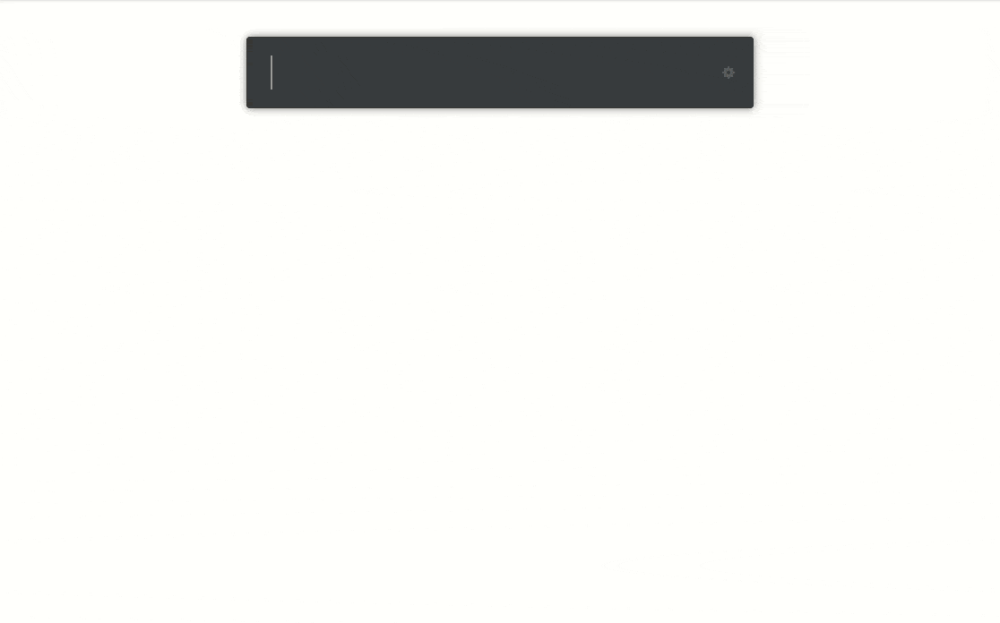

# ulauncher-gnome-settings

[Ulauncher](https://ulauncher.io) extension for accessing Gnome settings (Gnome Control Center panels) directly as if they were apps.





This extension is using experimental techniques to make Ulauncher keywords look and behave like apps. This comes with a couple of minor caveats but as of writing this, it works fine.

## How it works (primarily for extension developers)

Ulauncher extensions can add multiple keywords, but not apps.

Keywords and apps have different workflows. Both have searchable names (like "Google Translate"), but triggering it will have different behavior. Triggering an app name will launch the app. Triggering the keyword name will replace your input with the keyword followed by a space, waiting for you to type an argument.

In addition to this, keywords can be typed directly. This skips the fuzzy search step.

To avoid the additional step and "launch" instead, this extension uses default keywords that look like names. That way if you select "Display Settings" it will replace your input with "Display Settings " (not something else like "disp "). This will show briefly before the KeywordQueryEvent-handler closes Ulauncher and starts the settings app. It looks a lot less hacky this way, and you may not even think about it (see the gif).

Instead of spaces it's using an untypable blank character with the same width. Keywords can't contain spaces, since space is the separator between the keyword and the arguments. As a bonus, sinnce it can't be typed with a keyboard it can only launch via search (like apps).

Additionally, a similar workaround is used to avoid a problem with the order of the search results. This extension adds 20 keywords containing the word "Settings". This is more than the maximum search results Ulauncher shows. If you type just "settings" you wouldn't find the ordinary "Settings" application or "Print Settings" or "QT5 Settings". To avoid this, the "e" in "Settings" is actually a Ukrainian "Ye" letter. It looks identical with my font (compare "e" vs "е"). Ulauncher's search is rather forgiving so the slight mismatch won't have a big impact on the results, but will affect the sort order. The highlighting doesn't seem to distinguish between "e" or "е" so that works too.

Users can override keywords in Ulauncher's preferences (hence the "default" in `default_value`). If you do this, this extension will not work as intended, but you may want to delete keywords completely if you don't want a specific panel to appear in search.

## Alternatives

### ulauncher-gnome-control-center
[ulauncher-gnome-control-center](https://github.com/noam09/ulauncher-gnome-control-center) is very well written extension with internal logic for caching and sorting settings based on your use. It uses a "normal" ulauncher keyword however, so it has the extra step this extension was designed to avoid.

### Create or modify desktop entries
Ulauncher's app index is built from [desktop entries](https://specifications.freedesktop.org/desktop-entry-spec/desktop-entry-spec-latest.html).
gnome-control-center creates these, but specify that they shouldn't display in application menus and launchers. You can override this:

```sh
# Ulauncher will look for .desktop-files in ~/.local/share/
UAPP_DIR=~/.local/share/applications
# Assure user home dir for desktop entries
mkdir -p $UAPP_DIR
# Copy disabled gnome-control-center desktop entries to user home dir
cp -f /usr/share/applications/gnome-*-panel.desktop $UAPP_DIR
# Enable them (or more strictly disable "NoDisplay")
sed -i '/NoDisplay=true/s/^/#/' $UAPP_DIR/gnome-*-panel.desktop
```

Note that this will likely cause duplicate entries to appear for other launcher apps which makes exceptions for these, such as Gnome's "Show All Applications" (Super+A).

### Modify Ulauncher (not recommended)
You can change [Ulauncher's filter](https://github.com/Ulauncher/Ulauncher/blob/3c39799b119abf485fba07f8c80b4f79526e5fca/ulauncher/util/desktop/reader.py#L40) to override `app.get_nodisplay()` if `app.get_executable() == 'gnome-control-center'`.

Note that local modifications will be removed when you upgrade ulauncher.

## Credits
* noam09 for [the original extension](https://github.com/noam09/ulauncher-gnome-control-center) (this extension started off as [a suggestion](https://github.com/noam09/ulauncher-gnome-control-center/issues/2)).
* The icon is from the [Numix project](https://github.com/numixproject).
